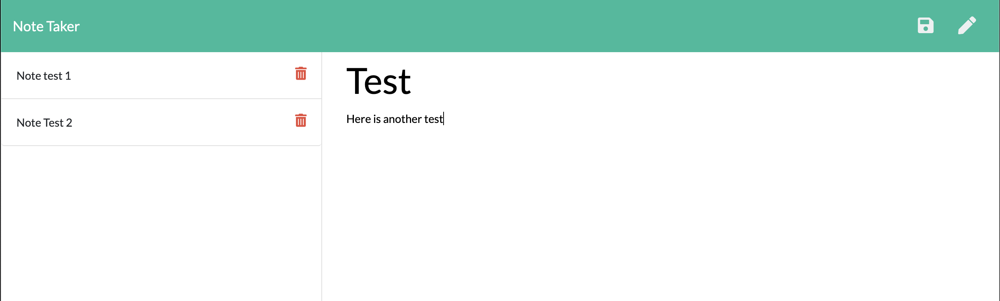

# Note Taker

## This app is deployed on Heroku. https://ads-notetaker.herokuapp.com/notes

## License

## Project Description

Using an express backend, create an application to write, save, and delete notes.

## Acceptance Criteria

- Application should allow users to create and save notes.
- Application should allow users to view previously saved notes.
- Application should allow users to delete previously saved notes.

## Github Username

https://github.com/arensalmela

## Screenshot

